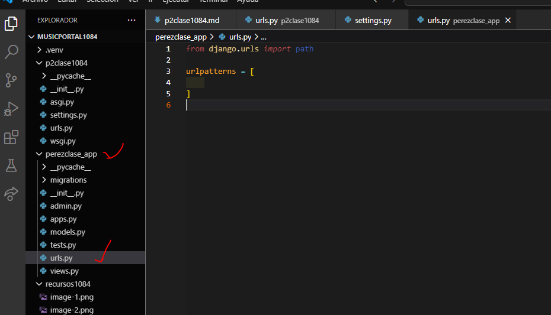

- Crear aplicacion perezclase_app
- comando --> python manage.py startapp perezclase_app
- Creamos el archivo urls.py en navaclase_app
- 
- En setting.py de p2clase1084
- 
- En urls.py de p2clase1084

- En urls.py en perezclase_app
- 
- En views.py en perezclase_app
- 
- En urls.py en perezclase_app
- 